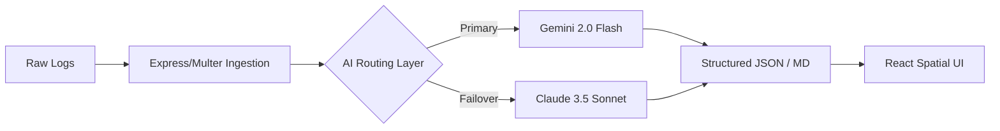

# RedReport

<div align="center">

<!-- Custom SVG Banner -->
<svg width="600" height="120" viewBox="0 0 600 120" fill="none" xmlns="http://www.w3.org/2000/svg">
  <rect width="600" height="120" rx="16" fill="#0A0A0A"/>
  <rect x="2" y="2" width="596" height="116" rx="14" fill="transparent" stroke="#DC2626" stroke-width="2" stroke-dasharray="10 5"/>
  <path d="M50 60 L80 30 L110 60 L80 90 Z" fill="#DC2626" opacity="0.8"/>
  <path d="M65 60 L80 45 L95 60 L80 75 Z" fill="#0A0A0A"/>
  <text x="140" y="65" font-family="monospace" font-size="36" font-weight="900" fill="#FFFFFF" letter-spacing="-1">Red<tspan fill="#DC2626">Report</tspan></text>
  <text x="142" y="90" font-family="sans-serif" font-size="12" font-weight="bold" fill="#6B7280" letter-spacing="4">CYBER NINJA ASSISTANT</text>
  <circle cx="530" cy="60" r="4" fill="#DC2626">
    <animate attributeName="opacity" values="1;0;1" dur="2s" repeatCount="indefinite"/>
  </circle>
  <text x="545" y="64" font-family="monospace" font-size="10" fill="#DC2626">SYSTEM ONLINE</text>
</svg>

**Automated Threat Analysis and Remediation Blueprints at the speed of AI.**

[](https://reactjs.org/)
[](https://nodejs.org/)
[](https://tailwindcss.com/)
[](https://www.framer.com/motion/)

</div>

---

## Problem

Security teams are drowning in raw telemetry. Translating chaotic Nmap, Metasploit, or syslog output into standard frameworks like MITRE ATT&CK is manual and time-consuming. The delay between discovering a vulnerability and writing a patch script leaves infrastructure exposed.

## Solution

RedReport is an elite Cyber Ninja Assistant, "Jarvis", that replaces manual triage with an orchestrated AI workflow from raw log to remediation script in seconds.

## Core Modules

- Intelligence Engine (Analysis): Conversational AI that ingests raw telemetry files and translates them into boardroom-ready threat intelligence. It includes a dynamic toggle for Executive Intel and Investor Brief reports.
- SOC Dashboard: A premium, real-time Security Operations Center utilizing Recharts to map network telemetry streams and threat vector distributions.
- Forensics Telemetry: A native macOS terminal UI to stream ingested logs, paired with an AI-generated vertical timeline mapping the chronological blast radius of an attack.
- Defensive Orchestration (Mitigation): Instantly translates vulnerability profiles into deployable Terraform and Ansible Infrastructure as Code playbooks.
- Secure Dossier Archives (Reports): Automatically archives generated intelligence and exports branded PDF payloads using native HTML-to-PDF compilation.

## System Architecture

RedReport uses a fault-tolerant, dual-engine LLM backend routing system.



## Tech Stack

- Frontend: React, Vite, Framer Motion, GSAP, Tailwind CSS
- Backend: Node.js, Express, Axios
- Reporting: marked and html2pdf.js for local PDF rendering

## Local Setup and Installation

1. Clone the repository.

   ```bash
   git clone https://github.com/yourusername/RedReport.git
   cd RedReport
   ```

2. Configure the backend environment.

   Navigate to the server directory and create a `.env` file for your AI engine API keys.

   ```bash
   cd server
   touch .env
   ```

   Add the following to `.env`:

   ```bash
   PORT=5000
   NVIDIA_API_KEY=your_nvidia_api_key_here
   GEMINI_API_KEY=your_gemini_api_key_here
   CLAUDE_API_KEY=your_claude_api_key_here
   USE_DEMO_MODE=false
   ```

3. Install dependencies.

   Open two terminal windows, one for the client and one for the server.

   Backend:

   ```bash
   cd server
   npm install
   npm run dev
   ```

   Frontend:

   ```bash
   cd client
   npm install
   npm run dev
   ```

4. Open the application.

   Navigate to http://localhost:5173 in your browser.

## Netlify Deployment

This repository includes `netlify.toml`, which builds the Vite frontend from `client/` and deploys the Express backend as a Netlify Function from `server/netlify/functions/api.js`.

1. Create a new Netlify site from this repository.
2. Leave the build settings on the repository defaults. Netlify will use:

   ```bash
   npm --prefix server ci && npm --prefix client ci && npm --prefix client run build
   ```

   The publish directory is:

   ```bash
   client/dist
   ```

3. Add these environment variables in Netlify:

   ```bash
   NVIDIA_API_KEY=your_nvidia_api_key_here
   GEMINI_API_KEY=your_gemini_api_key_here
   CLAUDE_API_KEY=your_claude_api_key_here
   USE_DEMO_MODE=false
   ```

   For a demo deployment without live AI keys, set `USE_DEMO_MODE=true`.

4. Deploy. Frontend requests go to `/api`, and Netlify redirects them to the serverless Express backend automatically. The catch-all redirect also sends direct page loads back to `index.html`, preventing Netlify's page-not-found error.

## Design Philosophy

RedReport strips away bloated multi-color SIEM interfaces. It uses a strict black, white, and red palette with spatial glassmorphism, native OS elements, and continuous matrix-style data stream backgrounds for an immersive SOC workflow.

## License

This project is distributed under a custom restrictive license. See [license.md](license.md) for the full terms.
